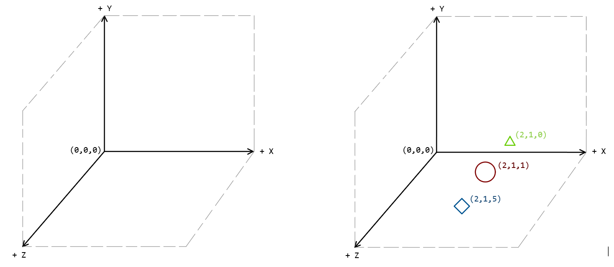

# Ray Tracing
Simple ray tracer (pathtracer) following [Peter Shirley's "Ray Tracing in One Weekend" Series](https://raytracing.github.io/).  

## C Version
_06.05.2025_: I decided to rewrite this entire thing in C, because I'm learning it for uni at the moment, and I guess, why not? ツ  
Maybe I'll actually do it, maybe not, stay tuned.  

## Java Version (Legacy)
_2023, sometime_: Shirley originally coded his version in C++ which I don't know at all, so I used Java for my first version. I did most of the transpiling on my own but also used _ChatGPT_ by _OpenAI_ to help sometimes.

### Python Version (Legacy)
_I originally coded everything in Python, but that was too slow, which is why I ported everything to Java after chapter 8.4.  
The python script requires `tqdm` to be installed. Install it using `pip install tqdm`._

### Dev-Log
I saved some images of the progress of the ray tracer in the `/images` directory. The name of the image corresponds to the chapter, after which I generated that image.  

At the time of writing this (18.05.2023), I have finished the first book in the series (see `/images/chapter_1_13.png` for the result) and will be continuing with at least the second book and maybe even with the third one.  
Sadly the ray tracer is again really slow when rendering with high-quality settings. In low-quality and with a small image size it runs quite fast, though.  

__Update:__ As of today (15.07.2023), I have finished the second book in the series (see `/images/chapter_2_10.png` for the result). I will probably not continue with the third book as it involves a lot of high-level math, that I don't understand.
However I will try to implement more features, first of all the ability to render triangles, which will enable me to render any mesh I want.

## General Notes / Remarks
Some notes and remarks to different chapters, changes or concepts.

### Coordinate System
As the position of the viewpoint and everything that needs to be rendered has to be hardocoded, it is important to understand how the coordinate system used works.
To help understand see the image below:  

The example on the right shows a sphere (red) at the coordinates (2, 1, 1).  
To capture this sphere from, the front the viewpoint needs to be "in front" of the sphere, meaning its z-coordinate needs to be bigger. Thus, its coordinates are (2, 1, 5).  
The point that the camera looks at from the viewpoint is "behind" the sphere at (2, 1, 0) (on the x/y-plane).

### Image for Chapter 2.3
It appears as if nothing much has changed between this image and the ones for the to previous chapters, however thanks to the implementation of Bounding Volume Hierarchies the rendering was done about 4 times faster, even with more spheres than before.

### High Resolution images
Some high resolution pictures can be found in the `/images/HighRes` directory. These were generated in 4K resolution (3840 x 2160 pixels) with around 500 samples per pixel. These take pretty long to render on my machine, but they hardly have any noise at all which does make it quite worth the wait.  
Feel free to use these pictures as wallpapers etc.  
#### Properties and render times
Image 1: 500 samples per pixel / about 40 minutes  
Image 2: 350 samples per pixel / about 40 minutes  
Image 3: 250 samples per pixel / about 1 hour  
Image 4: 300 samples per pixel / about 5 hours (!)  
Image 5: 400 samples per pixel / about 2 hours (not the best result)

### Instance Rotations in `Hittable.java`
In the original book, Shirley only programs the instance rotation around the y-axis. I wanted to add rotation around the other axes as well, which is why I added the `RotateX` and `RotateZ` classes as well.  
An example of all these rotations can be found at `/images/chapter_2_08.2_2.png`.
